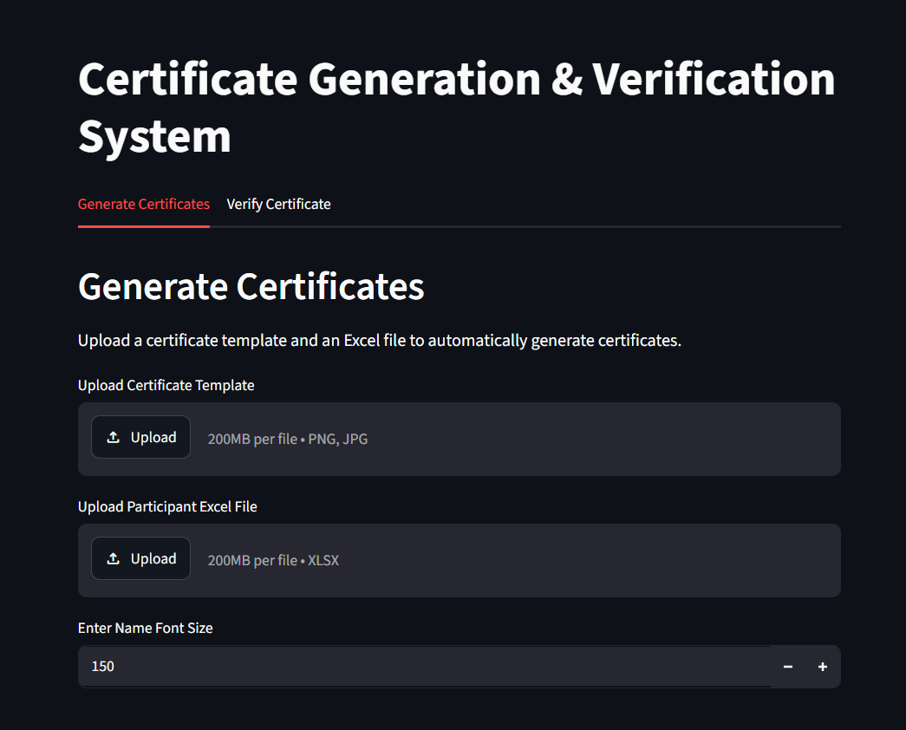
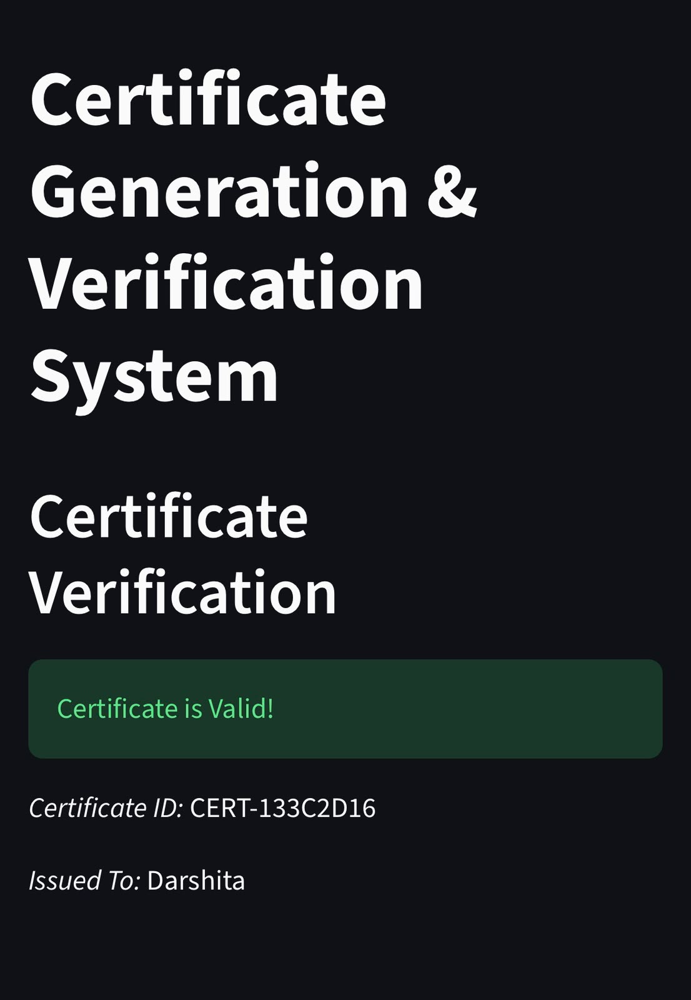

# Certificate Generation and Verification System

A web-based application that automates the process of generating and verifying digital certificates.

The system allows users to upload participant details through an Excel file and generate personalized certificates in bulk. Each certificate is assigned a unique Certificate ID and QR code that can be scanned to verify the certificate through the deployed web application.

## Features

- Upload participant details using an Excel file
- Upload a custom certificate template
- Automatically generate personalized certificates
- Generate unique Certificate IDs
- Generate QR codes for certificate verification
- Bulk certificate generation
- Download all generated certificates as a ZIP file
- Manual certificate verification using Certificate ID
- QR-based automatic certificate verification
- Deployed as a web application using Streamlit Community Cloud

##  Technologies Used

- Python
- Streamlit
- Pandas
- Pillow (PIL)
- QRCode
- OpenPyXL
- Git & GitHub

##  How It Works

1. The user uploads a certificate template.

2. The user uploads an Excel file containing participant names.

3. The application reads participant data using Pandas.

4. A unique Certificate ID is generated for every participant.

5. The participant's name and QR code are added to the certificate template.

6. The generated certificates are packaged into a ZIP file for download.

7. The Certificate ID is stored for verification.

8. When the QR code is scanned, the deployed Streamlit application opens and automatically verifies the Certificate ID.

##  Project Structure

    certificate-generation-verification-system/
    │
    ├── app.py
    ├── requirements.txt
    ├── .gitignore
    ├── README.md
    └── font.ttf

##  Installation

Clone the repository:

    git clone <your-repository-url>

Navigate to the project directory:

    cd certificate-generation-verification-system

Install the required dependencies:

    pip install -r requirements.txt

Run the application:

    streamlit run app.py

## Input Format

The uploaded Excel file must contain a column named:

    Name

Example:

| Name |
|------|
| Satakshi Rai |
| Participant 2 |
| Participant 3 |

##  Certificate Verification

Every generated certificate contains a unique QR code.

When the QR code is scanned:

    QR Code
       ↓
    Opens Deployed Application
       ↓
    Reads Certificate ID
       ↓
    Checks Certificate Records
       ↓
    Displays Valid or Invalid Result

Users can also manually enter a Certificate ID in the verification section of the application.

##  Live Application

The project is deployed using Streamlit Community Cloud.

Add your deployed application link here.

##  Screenshots

## 🔮 Future Improvements

- Integration with a persistent cloud database
- User authentication and admin dashboard
- Email delivery of generated certificates
- Custom certificate positioning and font selection
- Certificate generation analytics

## 👩‍💻 Author

*Satakshi Rai*

B.Tech Computer Science and Engineering (Artificial Intelligence & Data Science)
